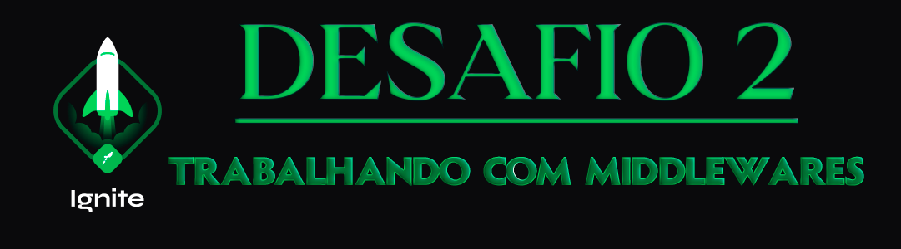

  

<h1 align="center"> RocketSeat 🚀 Ignite NodeJS 🌠</h1>

  
  
  
  

## 🧠 Detalhes do desafio

Nesse desafio você irá trabalhar mais a fundo com middlewares no Express. Dessa forma você será capaz de fixar mais ainda os conhecimentos obtidos até agora. 

Para facilitar um pouco mais do conhecimento da regra de negócio, você irá trabalhar com a mesma aplicação do desafio anterior: uma aplicação para gerenciar tarefas (ou *todos*) mas com algumas mudanças.

Será permitida a criação de um usuário com `name` e `username`, bem como fazer o CRUD de *todos*:

- [x] Criar um novo *todo*;
- [x] Listar todos os *todos*;
- [x] Alterar o `title` e `deadline` de um *todo* existente;
- [x] Marcar um *todo* como feito;
- [x] Excluir um *todo*;

Tudo isso para cada usuário em específico. 

📌 Além disso, dessa vez teremos um plano grátis onde o usuário só pode criar até dez *todos* e um plano Pro que irá permitir criar *todos* ilimitados, isso tudo usando middlewares para fazer as validações necessárias.

  

Feito com ❤️ por [Augusto Hermes](https://github.com/augustohermes) 👋.
